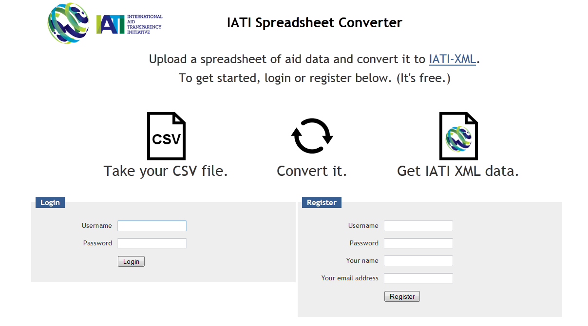
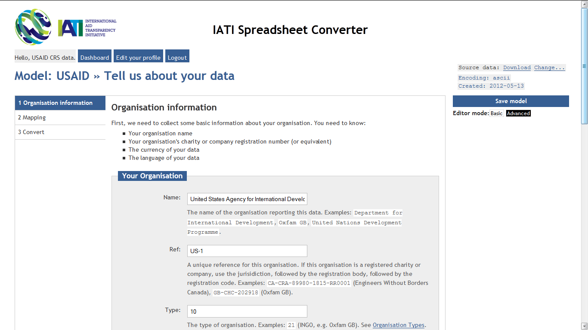
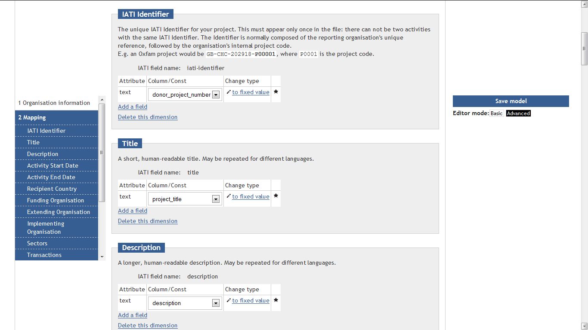
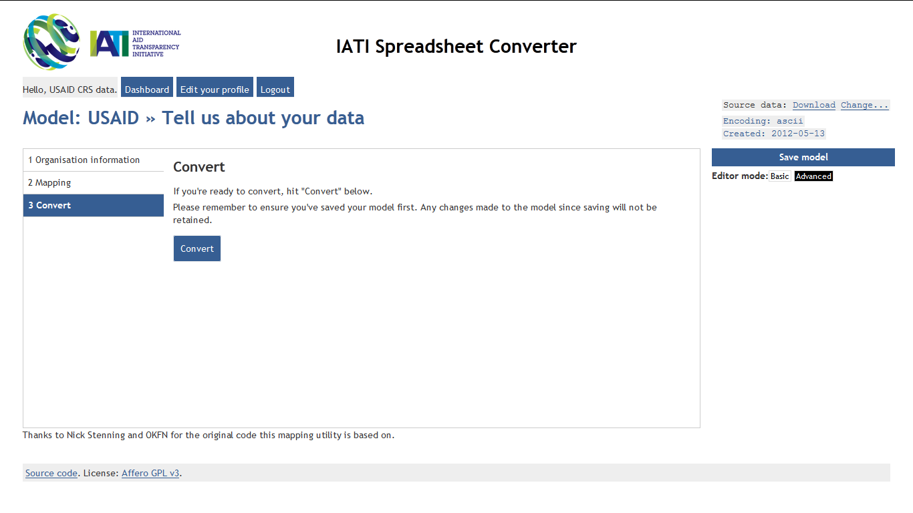

IATI Conversion Tool
====================

Summary
-------

The International Aid Transparency Initiative (IATI) is the emerging common standard for aid data. As increasing numbers of organisations are working to publish their aid data to IATI during 2012, the IATI Secretariat has been working on a number of tools to help make this process easier.

The IATI Conversion Tool is aimed at organisations that have too many projects to enter manually into a web-entry platform, but not enough projects to have in-house technical support that could help with implementation. It will make publication less labour-intensive and significantly increase capacity to publish more data from more organisations.

Map and convert data to IATI
----------------------------

The IATI Conversion Tool provides a service to convert a spreadsheet of aid data into the IATI format (technically called “IATI-XML”). Spreadsheets will have to satisfy some minimum conditions for the way they are formatted, but the Conversion Tool is flexible enough to allow a broad range of organisations to convert their data without much work required in advance.

To use the Conversion Tool, you will need to:

1.  Extract the data from your internal project management system;

2.  Make sure the data is a single spreadsheet, and saved in the CSV (“comma-separated values”) format[1](#sdfootnote1sym);

3.  Upload the data to the Conversion Tool website;

4.  Map the columns in your data across to the IATI Standard fields (you don’t need to be too familiar with the Standard, but you should consult the IATI Activity Standard if you are unsure: [http://iatistandard.org/activities-standard/overview](http://iatistandard.org/activities-standard/overview));

5.  Check that you’re happy with the mapping you’ve created (you might want to share it around your organisation);

6.  Click “Convert” and your will receive your data back as IATI-XML.

7.  If you’re happy with what you’ve created, you will be able to register your data with the IATI Registry.

Organisations can use the mapping they’ve created for frequently re-publishing updated data, by simply uploading a new CSV file and clicking "Convert". The service is available as open-source software, so organisations could run the service on their own web servers to convert directly out of their internal systems.

Accessing the tool
------------------

To access the tool, visit [http://csvconverter.aidinfolabs.org](http://csvconverter.aidinfolabs.org)

If you have any questions about how to use the tool or queries about implementation, please contact The IATI support team at [support@iatistandard.org](mailto:support@iatistandard.org)

Technical preconditions for the data
------------------------------------

The tool has certain preconditions for how the data must initially be formatted in order to be converted:

1.  The spreadsheet must be in the CSV ("comma-separated values") format;

2.  The spreadsheet must be well-structured (e.g. no illegal characters; only values in “value” columns – so no € or \$ signs, for example);

3.  Data must use valid codelists as defined at [http://iatistandard.org/codelists](http://iatistandard.org/codelists), and codes must be incorporated as a separate column in your data.

4.  The data quality is the responsibility of the data provider – the conversion tool will not provide any cleaning or reconciliation services;

5.  Multiple rows per activity are accepted, but only of one field. So, you can have multiple transactions rows per activity OR multiple sector rows per activity, but not both;

6.  Multiplicity of similar columns is accepted (e.g. title in English and French);

7.  Columns can be named however the data provider wants in the original spreadsheet.

Preparing your data
-------------------

Different organisations have different ways of storing and exporting data, so the exact process you will need to undertake will vary.

**Firstly, export the data from your system. You need to have:**

1.  All of the data in a single spreadsheet;

2.  Multiple rows per activity if possible – for example, if you have multiple transactions for one activity, or multiple sectors for one activity.

3.  You can have as many columns in the data as you want, so if you have two titles in two different languages, you can export them both (e.g. as columns \`title\_english\` and \`title\_french\`) and include them in your IATI data file.

4.  Preferably export in "CSV" format. If you can't do this directly, then open the spreadsheet in Excel, go to File/Save As... and in the "Save as type" drop-down box, select "CSV (comma-separated values).

**Then, you need to make sure you are using all the necessary codelists.**

1.  **Countries –**If you have one column stating the recipient country (it might be \`recipient\_country\`), make sure you have a second column stating the recipient country code (maybe \`recipient\_country\_code\`). This should be the ISO-2 code found on the IATI Standard website:

[http://iatistandard.org/codelists/country](http://iatistandard.org/codelists/country)

1.  **Transactions** – If you have many rows with different types of transactions for each activity (e.g., one row for commitments and one row for disbursements), make sure you have a column the states the transaction type (the text – for example, Disbursement) and another column stating the transaction type code (e.g. \`D\`). The transaction types and codes should be those stated on the IATI Standard website:

[http://iatistandard.org/codelists/transaction\_type](http://iatistandard.org/codelists/transaction_type)

1.  For other elements in the IATI Standard, if all of your activities use the same classification (e.g., all of the same aid type, or finance type), then you do not have to include this in your data – you can state in the mapping user interface that all your activities use the same classification.

**Upload your data**

1.  Log on to [http://csvconverter.aidinfolabs.org](http://csvconverter.aidinfolabs.org)

2.  Register to create an account (it's free, and with the exception of administrators, only you will be able to see your own data).

3.  Once you're logged in, create a "model", which describes how your data relates to the IATI Standard. Just give it a name, and select your data file to upload.

4.  At this point, the service will do some basic checks on your data, to make sure that it is provided in the CSV format, and it will also detect some other things like the character encoding in your data.

5.  If you upload the wrong file, don't worry – you can upload another one later on.

**Provide some basic information about your organisation**

1.  Provide the name of your organisation, the unique organisation ID according to the IATI Standard, and the type of your organisation. The unique organisation ID, if you are an official donor, is available from the IATI Standard website at:

[http://iatistandard.org/codelists/organisation](http://iatistandard.org/codelists/organisation)

If you are not an official donor, then your organisation ID takes the following format:

[Your country of registration's ISO-2 code]-[National registration body you are registered with (e.g. company or charity register)]-[The national registration body's unique ID for your organisation]

For example:

GB-CHC-202918 (United Kingdom, Charity Commission, Oxfam GB)

Contact the IATI Secretariat if you are unsure about this.

1.  Then provide the default currency for your data and the language it's provided in.

2.  Finally, explain the data structure that your uploaded data is provided in. Are there multiple transaction-rows per activity, or multiple sector-rows? Or, do you just have one row per activity?

**Map your data**

1.  From the left-hand side navigation, click on "**2. Mapping**".

2.  This part looks slightly complicated, but it's actually relatively straightforward. Using the user interface, you can describe how your data relates to the IATI Standard.

3.  The default screen will show you the list of elements that you could use in converting your IATI data.

4.  For each part of the IATI Standard – each field in each element or dimension – from the drop-down box, select the column that contains the relevant data.

    1.  For example, if you are looking at the Title element, select the column that contains the project title in your uploaded file.

    2.  If you're looking at more complex elements, for example, Sector, which contains several parts (the text of the sector name, the code for the sector, the percentage of the project assigned to that sector), then again, for each part, select the column in your data that contains that information.

    3.  In some cases, you will have information that is the same for all your activities – for example, the funding organisation. In that case, you can click to change the type of data by clicking "to fixed value" alongside the relevant field. You can switch back again to choose a column by clicking "to column in data".

5.  If there are some fields or dimensions that are not relevant to your data, you can click the rubbish bin next to the field or the "Delete this dimension" link to delete the entire dimension.

6.  You can save your mapping at any time and come back to it later. Just click the blue "Save model" button on the right hand side.

**Convert your data**

1.  When you're ready to convert your data, first make sure you've saved your mapping by clicking the blue "Save model" button on the right hand side.

2.  Then, from the left hand side navigation, click "**3. Convert**". You may have to scroll down to see this link.

3.  Click the big blue "Convert" button. Depending on the size of your data, it may take a few minutes for the process to complete. Do not reload your browser in this time or click the button again, as it will have to start again.

4.  If the conversion was successful, you will be able to download your converted IATI-XML data via a public link, or else register that manually with the IATI Registry. Make a note of the address of the data.

5.  If the conversion was unsuccessful, you should be informed of the errors. If you do not understand them (or what to do about it), please get in touch with the IATI Secretariat, providing details about the page you were on at the time and any errors that may have been provided.

**Uploading and converting new data**

1.  Once you've described how your data relates to the Standard, you might want to publish again once a month. You can do this without mapping your data all over again.

2.  When you open a model, in the top right hand corner you'll see the following:

1.  Click on the Change... link and you will see all of the files that you have uploaded so far.

2.  Click "Upload new file", select the file, and click Upload. Your new file will be selected by default.

3.  If the data is structured in exactly the same way, you can just click "3. Convert" from the left hand side navigation and your data will be converted.

[1](#sdfootnote1anc) There are other preconditions required for your data: see below.
